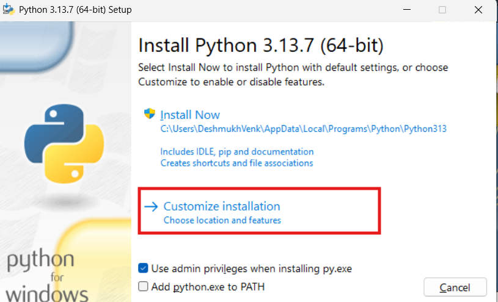
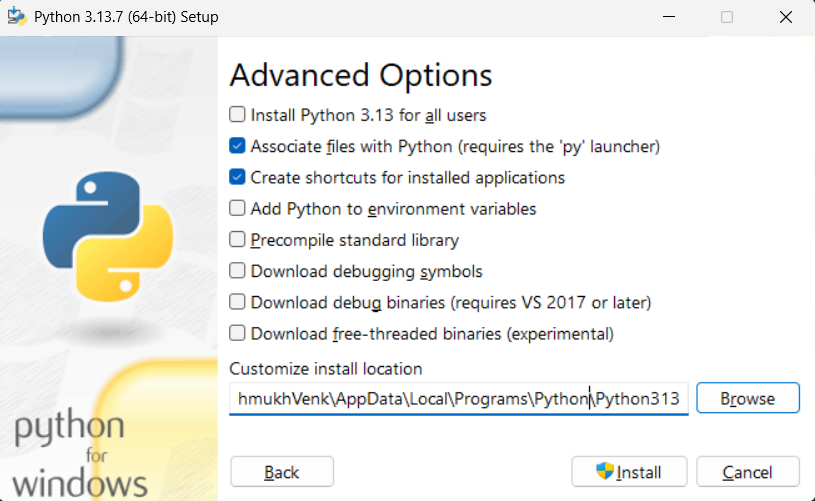
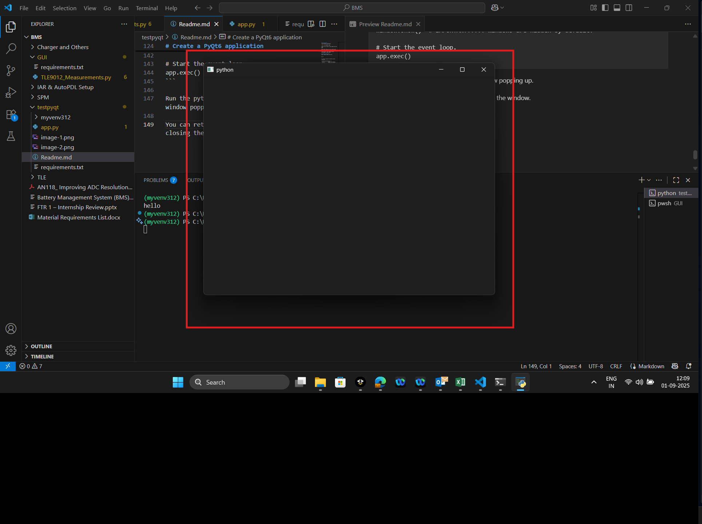
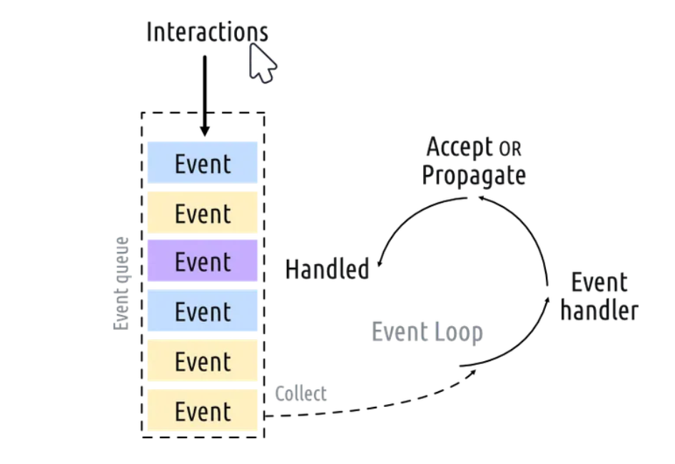

# Setup


## Check Python Installation
```py -0```

This will Show all existing python installations.
Multiple versions of Python can be installed in a single PC.

## Download Compatible Python version 3.12.7 

1.Local File :
"C:\Users\DeshmukhVenk\Downloads\python-3.12.7-amd64.exe"
***
2.Python Website:
https://www.python.org/downloads/release/python-3127/

## Installation
Click Custom installation



Then tick all boxes on next page and click next
***

Keep these changes and see install path


Click Install (This requires admin previlages so setup iArm)

### Check Installation
Open command prompt and enter : 

```
py -0
```

You should atleast one python version installed
 ```
C:\Users\DeshmukhVenk>py -0
 -V:3.13 *        Python 3.13 (64-bit)
 -V:3.12          Python 3.12 (64-bit)
 ```

Asterisk on a version indicates that it is default version. We dont need our version to be default. We will configure it in virtual environment.

## Create a new folder for project

Create a new folder project any where you want. Open that folder in VSCode.

Open a new terminal (Ctrl + Shift + `)

Check if in correct directory or navigate to it. Using cd commands.


Verify python installation and version

```
python --version
```

You should see the python version in use.
```
PS C:\Users\DeshmukhVenk\Desktop\BMS\testpyqt> python --version
Python 3.12.7
```

## Create a virtual environment
Virtual environment enables us to use different versions and same time,manage dependencies and isolate project environment to avoid confilcts.

```
py -3.12
python -m venv myvenv312
```

To install with specific version , add the python path instead of "python" in above command

```
PS C:\Users\DeshmukhVenk\Desktop\BMS\testpyqt> .\myvenv312\Scripts\Activate.ps1         
(myvenv312) PS C:\Users\DeshmukhVenk\Desktop\BMS\testpyqt> 
```
## Install packages through requirements.txt

Place the provided requirements.txt file into the project folder in root directory.

Then run below command.

```
pip install -r requirements.txt
```

Verify installation of packages after completed

```
pip list
```
You will see a list of installed packages

## Create an app

Create a new file named app.py in the root project directory.

```
New-Item app.py
```

Try inserting hello world program. Insert below line in app.py file and save.

```
print("hello world !!!")
```

Try to run it >>

```
python app.py
```

If you see output printed on terminal that means everything is running properly.

Setup is complete.

***
# Create a PyQt6 application


PyQt Documentation : https://www.riverbankcomputing.com/static/Docs/PyQt6/module_index.html

Clear all app.py and create a basic application for gui.

```
from PyQt6.QtWidgets import QApplication, QWidget,QMainWindow

# Only needed for access to command line arguments
import sys

# You need one (and only one) QApplication instance per application.
# Pass in sys.argv to allow command line arguments for your app.
app = QApplication(sys.argv)

# Create a Qt widget, which will be our window.
window = QMainWindow()          #We can also use QWidget instead.
window.show()  # IMPORTANT!!!!! Windows are hidden by default.

# Start the event loop.
app.exec()
```

Run the python file and you will see a window popping up. This will be a blank window.


You can return to command line after closing the window.

We can create multiple windows in one app. [Try creating multiple windows !]

There are parent widgets and Child widets. Parents are the main windows and child components can be embedded into the parent windows.

## Understnading Event Loop



Each interaction with your application — whether a press of a key, click of a mouse, or mouse movement — generates an event which is placed on the event queue. In the event loop, the queue is checked on each iteration and if a waiting event is found, the event and control is passed to the specific event handler for the event. The event handler deals with the event, then passes control back to the event loop to wait for more events. There is only one running event loop per application.

Same as how interrups work in microcontroller.

***
## Main Window Design
Import push button and sizing functions.

```
from PyQt6.QtCore import QSize, Qt
from PyQt6.QtWidgets import QApplication, QMainWindow, QPushButton
```
Its always better to make a sublclass to create the main application for simpler use.

```
# Subclass QMainWindow to customize your application's main window
class MainWindow(QMainWindow):
    def __init__(self):
        super().__init__()                          # Constructor from parent class

        self.setWindowTitle("My App")               # Set Window Title
        button = QPushButton("Press Me!")           # Add a push button

        # Set the central widget of the Window.
        self.setCentralWidget(button)
```

Change window instance to function

```
window = MainWindow()
```

Run the app.
You would see a button in a window.

You can set the size of window with below function.
```
self.setFixedSize(QSize(400, 1000))             # X-Y
```

## Signals and Slots

In PyQt we can have signals for any widget for the user input. Slots are receiver functions.

We can connect a event to a event handeler to this signal

```
        button = QPushButton("Press Me!")
        button.setCheckable(True)
        button.clicked.connect(self.on_clicked_function)
```

Create a event handeler for button press.
```
    def on_clicked_function(self):
            print("Clicked")
```

Save and Run the app. Try pressing the button on window and you will see Clicked text on terminal.


At this point your code will look like this.

```
import sys

from PyQt6.QtCore import QSize, Qt
from PyQt6.QtWidgets import QApplication, QMainWindow, QPushButton


# Subclass QMainWindow to customize your application's main window
class MainWindow(QMainWindow):
    def __init__(self):
        super().__init__()

        self.setWindowTitle("My App")
        self.setFixedSize(QSize(400, 1000))             # X-Y

        
        button = QPushButton("Press Me!")
        button.setCheckable(True)
        button.clicked.connect(self.on_clicked_function)
        # Set the central widget of the Window.
        self.setCentralWidget(button)

    def on_clicked_function(self):
            print("Clicked")
        
app = QApplication(sys.argv)

window = MainWindow()
window.show()

app.exec()
```
## QWidgets

        widgets = [
            QCheckBox,
            QComboBox,
            QDateEdit,
            QDateTimeEdit,
            QDial,
            QDoubleSpinBox,
            QFontComboBox,
            QLCDNumber,
            QLabel,
            QLineEdit,
            QProgressBar,
            QPushButton,
            QRadioButton,
            QSlider,
            QSpinBox,
            QTimeEdit,
        ]

## QLayouts

Layout	Behavior
QHBoxLayout-Linear horizontal layout
QVBoxLayout-Linear vertical layout
QGridLayout-In indexable grid XxY
QStackedLayout-Stacked (z) in front of one another

## QGui

QPainter
QBrush
QPen 
QColor

### To Add wdiget to layout
layout.addWidget(QWidget object)

```
import sys

from PyQt6.QtWidgets import QApplication,QWidget,QVBoxLayout,QHBoxLayout,QGridLayout


class MainWindow(QWidget):
    def __init__(self):
        super().__init__()
        self.setWindowTitle("My App")
        self.setGeometry(100, 100, 600, 400)

        self.layout = QHBoxLayout()
        self.layout_red = QVBoxLayout()

        self.widget1 = QWidget()
        self.widget1.setStyleSheet("background-color: red;")
        self.layout.addLayout(self.layout_red)


        self.widget2 = QWidget()
        self.widget2.setStyleSheet("background-color: blue;")
        self.widget3 = QWidget()
        self.widget3.setStyleSheet("background-color: green;")
        self.widget4 = QWidget()
        self.widget4.setStyleSheet("background-color: yellow;")

        self.layout_red.addWidget(self.widget1)
        self.layout_red.addWidget(self.widget2)

        self.layout.addWidget(self.widget1)
        self.layout.addWidget(self.widget2)
        self.layout.addWidget(self.widget3)
        self.layout.addWidget(self.widget4)


        self.setLayout(self.layout)
        


app = QApplication(sys.argv)

window = MainWindow()
window.show()
app.exec()
```

***
## QtDesigner
Link to download :https://build-system.fman.io/qt-designer-download
Command to convert .ui file to .py file 
```
pyuic6 login.ui -o login.py
```
